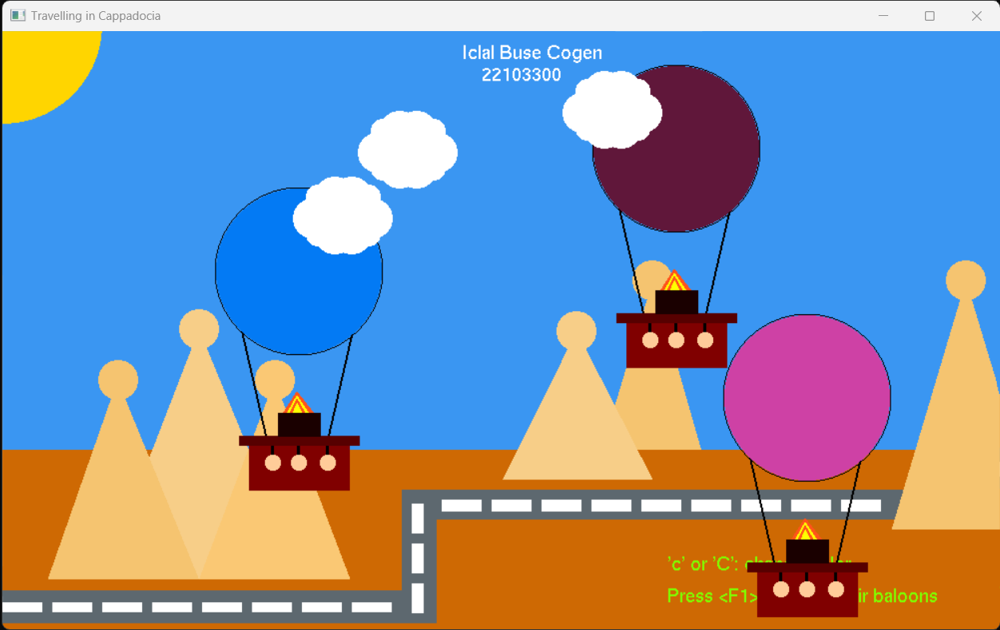
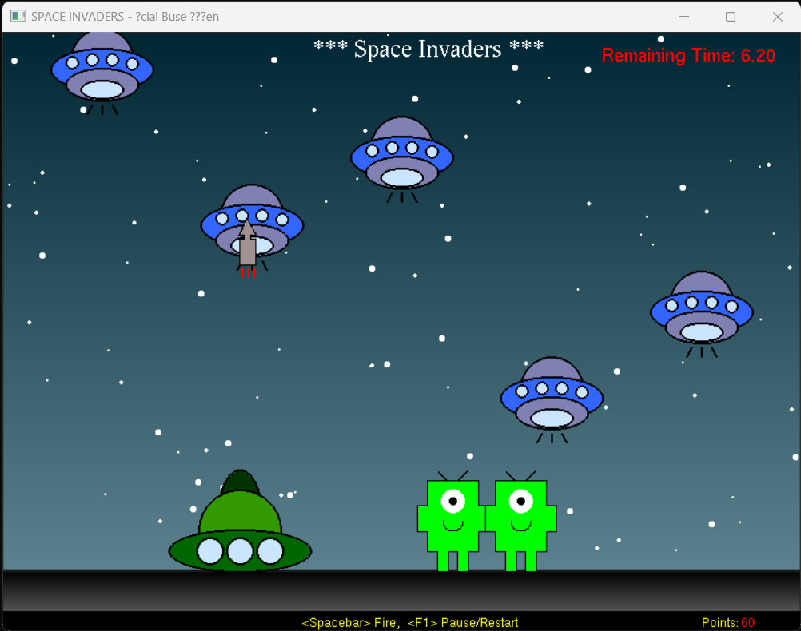
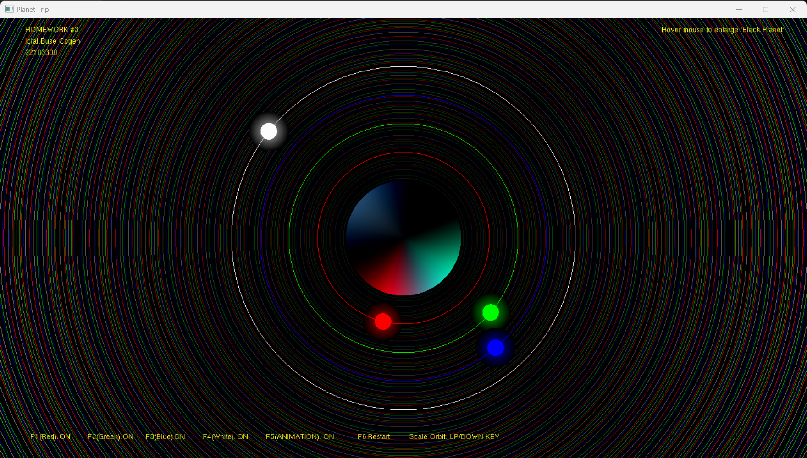

# OpenGL Projects

### CTIS164 Technical Mathematics with Programming
The fundamental concepts in technical mathematics and precalculus using programming. Functions and graphs, linear equations, plane analytic geometry, quadratic equations, trigonometry, vectors, matrices and determinants. Projects made by C and OpenGL:
- Cappadocia Trip
- Alien Invasion
- Planets

### <ins>CappadociaTrip.cpp</ins>

<b>AIM: </b> 

User create at most 10 complex shaped hot-air balloons at the click position on Cappadocia view background when clicking on screen. If the user presses F1 key, all the objects on the window start to animate by moving up. After firing, user cannot be able to create more objects until all the objects disappear on screen.

<b>FEATURES: </b>
* Three clouds that have different speeds and directions added
* *  If any cloud reaches the end of window, it changes its direction to opposite side
* * A cloud is in the background of all balloons, one in front of balloons 1 to 5 and in the background from 6 to 10, and one in front of all balloons.
* A sun, complex shaped roads and fairy chimneys have been added 
* Color of hot air ballons can be changed manually if you press 'c' or 'C'
* All ballons have random speeds
* User cannot stop the baloons when they are in motion
* After firing, new ballons cannot be added
* After all the ballons exit the screen, new objects can be added.
* In the beginning, an important message has been given as 'Click to Create Ballons (Max 10)'
* * If new ballons are added, this message disappears
* * After all the ballons exit the screen, the message reappears
* Program terminates when ESC key is pressed

### <ins>AlienInvasion.cpp</ins>

<b>AIM: </b> 

User try to remove complex shaped ufos from the screen using rockets leaving the tank weapon on Space bacground. If the user presses F1 key, game starts and user can start shooting the target. After the game start, user can pause/continue the game with F1 key. At the beggining, 5 ufos created automatically and come from upper side of the screen. A new ufo is created for the removed one. Game continue for 20 seconds. The user has 3 energy. If 3 ufos land on the ground, aliens invade the space and the game ends. Otherwise, the game continue until the time run out.

<b>FEATURES: </b>
* 100 random star is created for the backround of the game x-cord, y-cord and size of the starts are created randomly
* 5 ufos that have different speeds and directions added. If any of the ufos removed from the screen or land on the ground, a new ufos is created
* Complex shaped aliens that have different speeds and directions. If user cannot shoot a ufo until it lands on the ground, an alien is created at the position of the landed ufo. If the number of aliens reach 3, the game ends
* In addition to up, down,left and right special keys, tank weapon can move using 'a' and 'd' keys
* In addition to F1, 'r' key also restart the game even after the game starts
* Remaining time is shown on the top right corner of the window in the form of (seconds.milliseconds). An additional function is added to show the remaining milliseconds
* Before starting the game and after pausing the game, new rockets cannot be launched
* Ammo is limited by 10 bullets. After the bullets finish, ammo is refilled
* Collected points are counted until the game is over. Each succesful shot gain 10 points
* A proper beggining and ending messages are displayed
* Program terminates when ESC key is pressed

### <ins>Planets.cpp</ins>

<b>AIM: </b> 

Implement a program that simulates lighting effects on a circular object. One black planet and four light sources (red, green and blue,white) rotating in different orbits around the planet. Random values assigned for the radius, rotation speed and rotation direction of the planets. Lighting effect of all active light sources on the planet is calculated. A bottom bar that shows the status of light sources. F1, F2, F3 and F4 keys are used to switch their states. F5 key should pause/start the animation. F6 key should restart the animation by assigning new random values to the global variables

<b>FEATURES: </b>
* 4th planet with white color is added as an additional light source
* Up/Down keys can be used to increase/decrease the radii of the orbits of the planets
* Vector application is used to add shining effect to planets which seems like beam of lights around the planets
* Vector application is used to draw colorful circle wires for backgroud. Distance impact to the color intensity of wires is used.
* Mouse hover is used to enlarge the radius of black planet which also impact the intensity of light sources

<b>ATTENTION: </b>Please use vector implementation provided in `lib/`to run the `Planets.cpp`